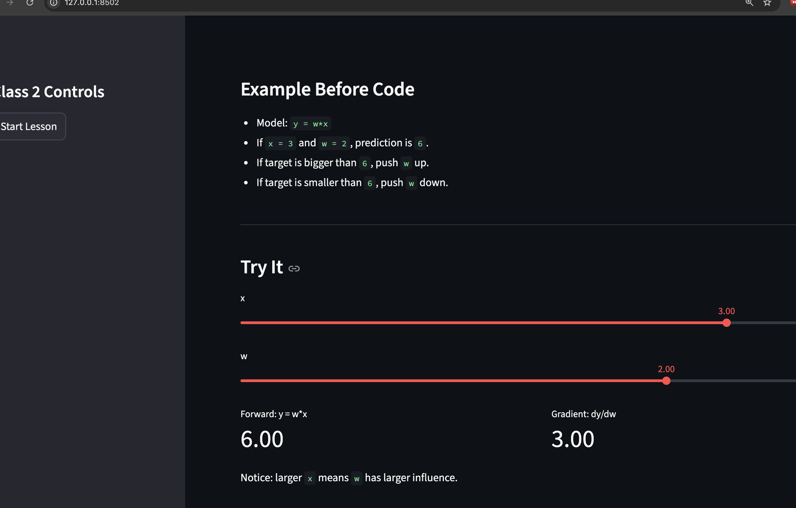
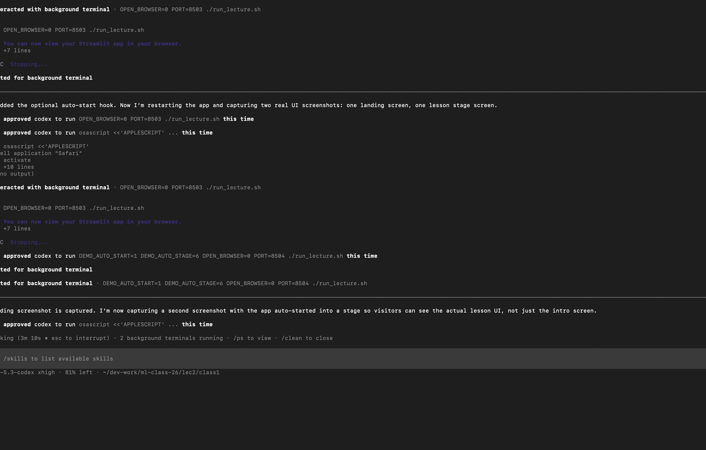

# Class 1: From Basics to Tiny Autograd

This repo is a hands-on ML class app.

It walks from very basic ideas (one neuron, one loss) to a tiny autograd engine, then shows the same ideas in vectorized NumPy and a small MLP demo. The app is built with Streamlit, so you can teach or learn by clicking through each stage instead of jumping between notebooks.

## Demo Preview

These are sample snapshots from the actual demo flow:




## What You Get

A guided lesson flow with 7 stages:

1. Scalar neuron basics
2. Losses + manual gradients
3. Computation graph + backprop order
4. Tiny autograd core
5. NumPy to PyTorch mirror
6. Scalar to vectorized math
7. End-to-end 2D demos (single neuron vs MLP)

Also included:

- Code-first examples in `mlstack/`
- Built-in quick checks and unit tests

## How To Run

### 1) Setup (one-time)

```bash
cd class1
./setup_env.sh
```

`setup_env.sh` will:
- Create/update `.venv`
- Install dependencies from `requirements.txt`
- Try to install CPU PyTorch
- Run `verify_env.py` so you can confirm versions

### 2) Launch the class app

```bash
cd class1
./run_lecture.sh
```

This starts Streamlit on `http://127.0.0.1:8501` and opens your browser.

In the sidebar, use:
- `Start Lesson`
- `Next` / `Previous`
- `Jump to stage`

### 3) Optional sanity checks

```bash
cd class1
source .venv/bin/activate
python run_quick_checks.py
python -m unittest discover -s tests -v
```

## Handy Notes

- It is designed for CPU/laptop use.
- If PyTorch install fails, you can still run most of the class.
- If you want setup to continue even without PyTorch:

```bash
ALLOW_NO_TORCH=1 ./setup_env.sh
```

## Project Layout

- `app.py`: Streamlit lecture app
- `setup_env.sh`: env setup + dependency install
- `run_lecture.sh`: app launcher
- `verify_env.py`: version/env check
- `run_quick_checks.py`: fast smoke checks
- `mlstack/`: teaching implementations (autograd, training, datasets, visuals)
- `tests/`: unit tests
